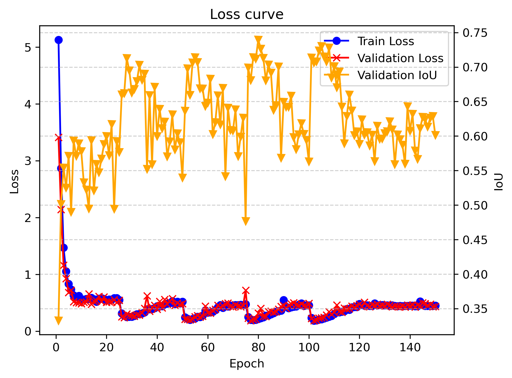
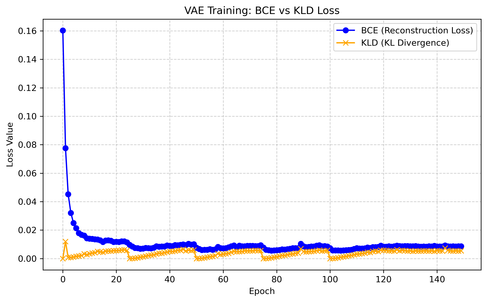
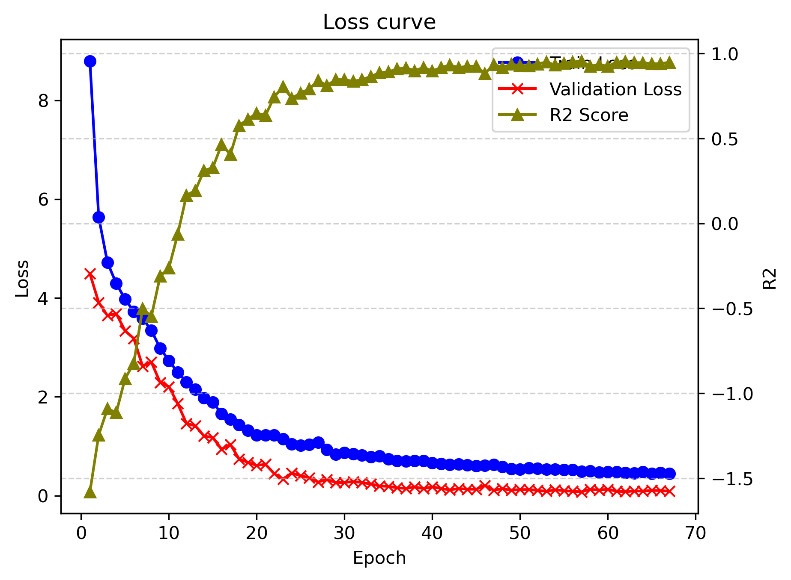
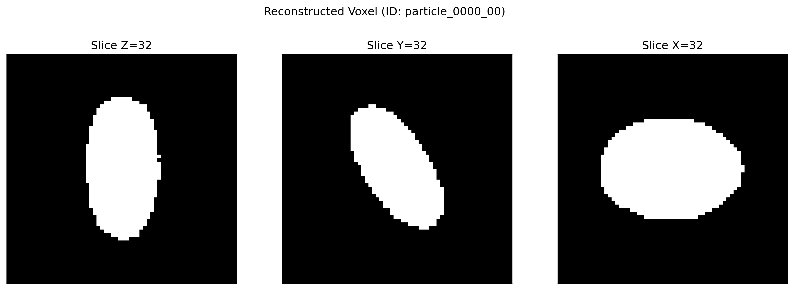

# Experiments
This repository is used to save **the experiment backup**.
## File structure 
Each of `exp [number]` means one single experiment. You can find the config easily at,
- config.yaml |-> It includes:  1. neural network sturcture, 
                                2. train setting, 
                                3. cycilical annealing setting
    
## Description
### Latent_Disentangle
Let latent dimension = 2. Check exp_num/config.yaml for more detial.
*Goals:* To investigate the capability of this framework, we make a serise of 
Experiments

---
Exp. 0 ~ 2, we study and compare the influnce of beta value (weight KLD) on geometries 
reconstruction quality, latent space shape, final prediction R2 score.
- Metrics of vae and mlp

|      | 0   | 1   | 2   |
| ---- | --- | --- | --- |
| *beta weight* | 0.1 | 0.5 | 1.0 |
| vae->IoU  |0.55 |  0.43   |  0.35   |
| mlp->R2  | 0.95 |  0.88   |  0.9  |

- Loss curve
    - exp0

    || | |
    |--- | ---| --- |
    - exp1

    || | |
    |--- | ---| --- |
    - exp2

    || | |
    |--- | ---| --- |

- Latent Space Plots
    - exp0

    || |
    |--- | ---|
    - exp1

    | | |
    |--- |--- |
    - exp2

    |  |   |
    |--- | ---|
### Reconstruction 
- exp0

| origin || |  |
|--- |--- |--- |--- |
| reconstruction ||  | |
- exp1

| origin || |  |
|--- |--- |--- |--- |
| reconstruction ||  | |

- exp2

| origin || |  |
|--- |--- |--- |--- |
| reconstruction ||  | |
## VAE Capacity Study
### Loss Curve
- exp3

|| | |
|--- | ---| --- |
- exp4

|| | |
|--- | ---| --- |
- exp5

|| | |
|--- | ---| --- |

### Latent Space Shape
- exp3

|  |   |
|--- | ---|
- exp4

|  |   |
|--- | ---|
- exp5

|  |   |
|--- | ---|
### Reconstruction
- exp3

| origin || |  |
|--- |--- |--- |--- |
| reconstruction ||  | |
- exp4

| origin || |  |
|--- |--- |--- |--- |
| reconstruction ||  | |
- exp5

| origin || |  |
|--- |--- |--- |--- |
| reconstruction ||  | |

